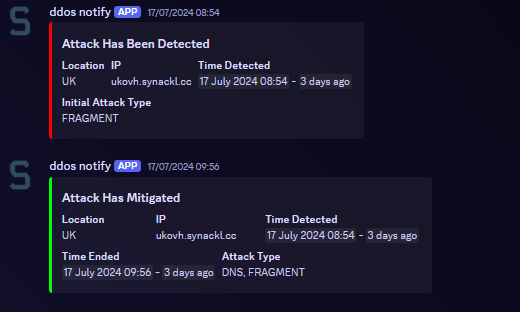

# OVH DDoS Alerts

This Node.js application monitors and alerts for potential DDoS attacks on OVH servers, sending notifications via a Discord webhook.



## Features
- Real-time monitoring of OVH servers for DDoS attacks.
- Instant alerts via Discord webhook.
- Easy integration and setup.

## Installation

### Prerequisites
- [Node.js](https://nodejs.org/) (>=14.0.0)
- npm (>=6.0.0)

### Steps
1. Clone the repository:
	```sh
	git clone https://github.com/D5GY/OVH-DDOS-Alerts.git
	```
2. Navigate to the project directory:
	```sh
	cd OVH-DDOS-Alerts
	```
3. Install the dependencies::
	```sh
	npm install
	```
### Configuration
1. Fill in your OVH API credentials and Discord webhook URL in the `src/config.js` file.

## Running the Application

To start the application, use the following command:
```sh
npm start
```

## Dependencies

This project uses the following npm packages:

-   [axios](https://www.npmjs.com/package/axios): Promise-based HTTP client for the browser and Node.js.
- crypto: Provides cryptographic functionality that includes a set of wrappers for OpenSSL's hash, HMAC, cipher, decipher, sign, and verify functions.


## Contact

For any inquiries, please join my discord: https://synackl.cc/discord